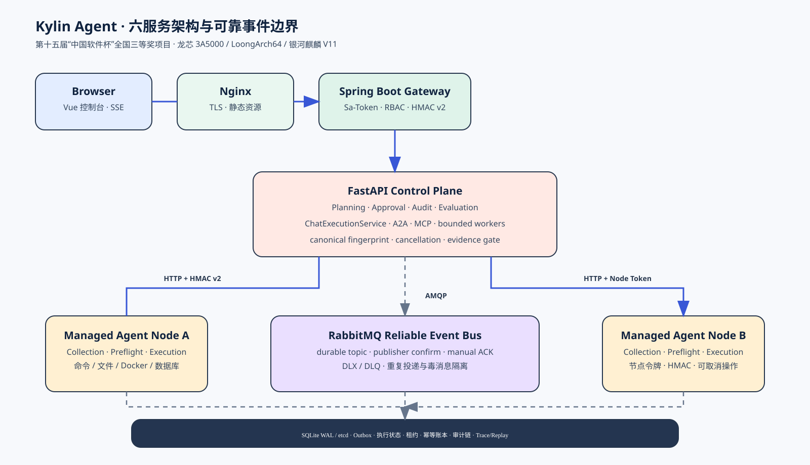
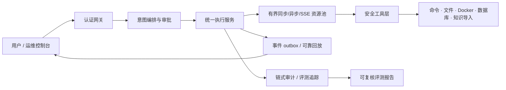

# Kylin Agent Showcase

<p align="center">
  <strong>可审计、可审批、可回放、可评测的企业级 Agent 运维平台</strong><br>
  第 15 届中国软件杯全国三等奖（国三）项目 · Showcase only · Source withheld
</p>



Kylin Agent 面向龙芯 3A5000 + 银河麒麟高级服务器 V11 的智能运维场景，把自然语言请求转成“意图识别 → 计划 → 工具调用 → 风险审批 → 执行 → 证据 → 评测”的闭环。它的核心价值不在于“接了一个模型”，而在于把 Agent 的不确定性收敛到可验证的工程边界：重复请求不会重复产生副作用，断线不会让终态消失，危险输入不会因为换一种编码或路径写法绕过护栏，长输出和长任务不会拖垮服务。

## 项目身份

- **赛事成果**：第 15 届中国软件杯全国三等奖（国三）。
- **当前工程版本**：`0.6.255`（主项目持续迭代中）。
- **适用场景**：主机巡检、Docker 与数据库运维、知识导入、集群节点协同、审批式变更和运行状态评测。
- **仓库定位**：本仓库只发布项目展示材料、架构图和脱敏后的评测摘要，不包含源码、模型密钥、生产数据或可直接部署的二进制包。

源码暂不公开，是因为 Kylin Agent 后续将作为毕业设计持续迭代；完整实现、完整数据集、提示词/模型配置和部署细节属于持续研究资产。这个仓库的目标是让评审者看清“解决了什么工程问题、为什么这样设计、有哪些可复核证据”，而不是制造一个无法运行的源码快照。

## 一眼看懂：它解决的不是普通 CRUD

| 多数实现会…… | Kylin Agent 用…… | 避免的具体问题 |
| --- | --- | --- |
| 在 REST、A2A、SSE 各写一套执行状态 | 统一 `ChatExecutionService` + canonical fingerprint + SQLite WAL | 同一个请求在不同协议下重复执行、一个接口成功而另一个接口仍显示 running |
| 用永久锁或进程内字典表示“正在执行” | owner token、租约 TTL、心跳和过期接管 | worker 崩溃后请求永久卡死，重启后无法判断是否可安全恢复 |
| 每个流式请求创建一个 daemon thread | 共享 64 worker/512 queue 的 SSE 执行池 | 并发连接无限创建线程，线程切换和内存压力放大延迟 |
| 一个无界队列同时承载阶段事件与终态 | 普通事件合并/丢弃，终态/审批/错误进入可靠缓冲 | 背压时 final 事件被旧日志挤掉，前端永远看不到最终状态 |
| `capture_output=True` 后再裁剪 | 分块读取 + 有界尾部环形缓冲 + `truncated` | 100 MiB 持续输出先把内存吃满，裁剪逻辑根本来不及运行 |
| 每次校验审计链都计算全表摘要 | chain tail 元数据、generation、data_version 和增量后缀校验 | 百万条审计记录下“缓存检查”仍然 O(n)，后台健康检查持续占 CPU/IO |
| 将不可用工具或安全失败当成通过 | hard gate、unavailable/not_executed 分离和失败样本保留 | 评测分数看起来很高，但真实能力边界和安全关键失败被掩盖 |

## 架构总览



详细说明见 [架构与数据流](docs/architecture.md)，可编辑图在 [diagrams/architecture.mmd](diagrams/architecture.mmd)。

### 核心模块边界

1. **接入与协议层**：REST、SSE、A2A、MCP 共享认证、请求体限制、速率限制和 trace 上下文。
2. **Agent 编排层**：解析意图、规划工具、检查参数 schema、决定是否需要澄清或人工审批。
3. **执行治理层**：以 `username:client_request_id` 为幂等主键，canonical JSON SHA-256 作为冲突指纹；跨实例 SQLite WAL 记录状态、owner 和租约。
4. **资源与背压层**：同步任务默认 8 workers/32 queue；SSE 默认 64 workers/512 queue；容量耗尽和 deadline 都是显式 API 结果。
5. **安全工具层**：命令护栏、路径规范化、Docker 标识校验、数据库标识符白名单、凭据声明和统一 sanitizer。
6. **证据与评测层**：审计链、outbox、工具效果记录和评测摘要共同回答“做了什么、凭什么说成功、哪里失败”。

## 量化证据：结果不只写“效果很好”

### 运行时治理与测试证据（2026-08-08）

| 能力 | 可复核数字 | 说明 |
| --- | ---: | --- |
| 统一执行生命周期 | 42 + 6 项 | Chat/A2A 路由回归 42 项；执行服务覆盖并发单飞、冲突、跨实例等待、重启复用、取消、TypeError 单次调用和租约恢复 6 项 |
| 异步任务隔离 | 55 项 | 覆盖有界线程池、容量拒绝、deadline、MCP/A2A/管理端/自动评测路由 |
| SSE 背压治理 | 38 项 | 覆盖可靠终态、普通事件合并/丢弃、固定 worker 上限和统计接口 |
| 输出边界 | 100 MiB / 20 MiB | 持续 100 MiB 命令输出和 20 MiB SafeExecutor 输出均以固定内存上限完成；结果携带 `truncated` |
| 评测中心定向结果 | 15 个 section | 评测摘要将 benchmark、审批、工具效果、性能、集群和安全等 section 分开记录 |

### 评测数据规模与阶段性结果

当前公开的是脱敏摘要，不是完整数据集：

| 阶段 | 可用数据集规模 | 本次评测用例 | 结果 |
| --- | ---: | ---: | --- |
| `v0.6.169` 历史基线 | 178 条 | 160 条 benchmark + 95 条系统/质量用例 | 252/255 通过，pass rate `99.60%`，score `0.9893`，hard gate 通过 |
| `v0.6.203` 阶段性基线 | 2,480 条 | 680 条 benchmark + 89 条系统/质量用例 = 769 条 | 764/769 通过，raw pass rate `99.35%`；2 个安全关键失败触发 hard gate，最终 score `0` |

这里必须区分三个数字：`available_records` 是数据集可用规模，`evaluated_records` 是本次进入 benchmark 的规模，`total` 是评测中心所有 section 的用例总数。阶段性基线没有把 2,480 条全部纳入，因此不能宣称“全量评测已经完成”；完整数据集重构和全量运行是主项目后续任务。

可直接查看脱敏 JSON：

- [v0.6.203 评测摘要](evaluation/evaluation-results-v0.6.203.json)：包含 2 个安全关键失败及 hard gate 语义。
- [v0.6.169 历史基线](evaluation/evaluation-results-v0.6.169.json)：用于说明版本、数据集规模和评测口径变化。
- [工具效果摘要](evaluation/tool-effect-summary-v0.6.169.json)：87 个注册工具中 22 个在当前主机可安全执行，22/22 验证通过；不可用和未执行不计入通过。
- [性能基线](evaluation/performance-baseline-v0.6.169.json)：历史本地 2 用例 P50/P90/P99 和吞吐记录。

## 评测维度

评测中心按以下维度组织，不用“模型回答像不像”代替工程验收：

- **任务成功率**：以目标状态和证据断言为准，不以 HTTP 200 或模型自报完成为准。
- **工具调用准确率**：工具名、参数 schema、参数完整性、调用顺序、重复调用和拒绝原因。
- **结果正确性与一致性**：同一请求重复运行、跨实例运行、重连回放的规范化结果一致性。
- **事实有据性**：关键事实绑定检索证据、工具返回或审计记录；无证据的答案不能算 grounded。
- **响应延迟**：首事件、首 token、工具完成、终态的 P50/P95/P99，而不是只记总耗时。
- **Token 成本**：按请求、模型、工具轮次、重试和上下文压缩分别计量。
- **人工接管**：区分主动审批、风险升级、超时接管和异常兜底，记录介入原因与恢复时间。

评测规则和数据边界见 [评测口径](docs/evaluation.md)。

## 安全与可靠性亮点

- 采用 SHA-256 请求指纹和唯一幂等账本；同一副作用请求重复提交只返回原执行记录，指纹变化返回冲突。
- 审计链支持 SHA-256 legacy、HMAC-SHA256 v3、logical clock、occurred_at_ns 和 key id；审计校验发现前缀变更时回退全链验证。
- 上传、请求体、Docker inspect/log、命令 stdout/stderr 和数据库 preview 都有明确字节/行数/单元格边界。
- `PASSWORD/TOKEN/API_KEY/SECRET/Authorization/Cookie` 等字段在跨 API 边界前统一脱敏。
- 危险命令、路径穿越、Unicode 路径混淆、Docker 参数注入和未授权变更在执行前被拒绝或要求审批。

详见 [安全说明](docs/security.md) 和 [演示脚本](docs/demo.md)。

## 展示仓库目录

```text
.
├── README.md
├── NOTICE.md
├── assets/architecture.svg
├── diagrams/architecture.mmd
├── docs/
│   ├── architecture.md
│   ├── demo.md
│   ├── evaluation.md
│   └── security.md
└── evaluation/
    ├── evaluation-results-v0.6.169.json
    ├── evaluation-results-v0.6.203.json
    ├── performance-baseline-v0.6.169.json
    └── tool-effect-summary-v0.6.169.json
```

目录中没有 `.py`、`.js`、`.java`、`.go`、`.sql` 等项目源码文件，也没有生产数据库和模型密钥。

## 演示建议

1. 提交相同 `client_request_id` 的 10 个并发请求，观察只有一个副作用执行。
2. 在 SSE 背压下制造大量普通阶段事件，观察终态仍可回放。
3. 让有界执行池达到 8/32 容量，观察 503/504 和底层任务容量释放时机。
4. 输入路径穿越、危险命令、全角/混淆斜杠和超大日志，观察 fail-closed、审批和 `truncated`。
5. 打开 `evaluation/` 中的 JSON，解释为什么 99.35% raw pass rate 仍然是 hard-gate failed。

## 后续路线

- 将 2,480 条可用数据集全部纳入统一 manifest、split 和 provenance，删除评测中心中无法由数据集支撑的虚构 section。
- 补齐任务成功率、事实有据性、Token 成本、延迟分位数和人工接管率的真实运行采样。
- 在 Linux/LoongArch、Docker 和多节点环境执行跨平台效果评测，区分 unavailable、not executed 和 failed。
- 继续以毕业设计版本迭代，待研究内容和授权边界稳定后再决定源码开放范围。
