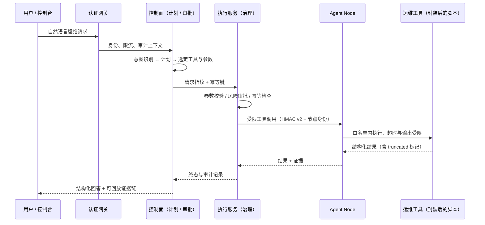

# Kylin Agent — 面向信创运维场景的可控式 AIOps Agent

> 第十五届“中国软件杯”A2 赛道 · 全国三等奖（国三）
> 龙芯 3A5000 · LoongArch64 · 银河麒麟高级服务器 V11

让 Agent 在国产信创环境中**可控、可审计、可回放、可评测**地执行运维任务。


本仓库是 Kylin Agent 的 Showcase，不包含源码、模型密钥、生产数据或可直接部署的二进制包。源码暂不公开，是因为项目将作为毕业设计继续迭代；这里公开的是可复核的架构决策、失败边界、评测口径和脱敏结果。

## 我的负责范围：运维与 Tools 封装

> 本仓库是团队项目的 Showcase。**以下只描述本人承担的运维侧工作**；架构设计、模型与评测口径等部分由团队其他成员完成，相关结论以对应文档为准，本文不做改写。

我负责把项目在信创环境里真正跑起来，并把运维脚本封装成 Agent 可调用的 `tools`。核心目标不是“让脚本能被模型调用”，而是让每一个运维动作都成为**参数可校验、权限有边界、失败可解释、结果可审计**的执行单元。

| 职责域 | 我具体做的事 | 相关文档 / 证据 |
| --- | --- | --- |
| 信创环境适配 | 在龙芯 3A5000 / LoongArch64 / 麒麟 V11 上梳理依赖与配置，约束哪些环节必须平台无关 | [`docs/loongarch-adaptation.md`](docs/loongarch-adaptation.md) |
| 服务部署与编排 | Nginx、Spring Boot 网关、FastAPI 控制面、Agent Node A/B、RabbitMQ 的启动顺序、依赖关系与健康检查 | [`docs/architecture.md`](docs/architecture.md) |
| 监控与故障定位 | 运行状态采集、日志查看、断线/卡死/重复执行等问题的定位路径 | [`docs/trace-replay.md`](docs/trace-replay.md) |
| 脚本工具化 | 把主机检查、服务状态、日志采集、资源查询、只读诊断脚本改造为注册工具 | [`evaluation/tool-effect-summary-v0.6.169.json`](evaluation/tool-effect-summary-v0.6.169.json) |
| 安全与审计 | 工具的参数校验、安全边界、审计字段和幂等约束 | [`docs/security-layers.md`](docs/security-layers.md) |

### 1. 信创环境适配

- 目标环境固定为 LoongArch64，架构相关依赖集中在文档解析、OCR、推理和镜像层，运维动作与治理逻辑保持平台无关，避免把指令集差异扩散到工具实现里。
- 二进制依赖优先使用 Loongnix 官方 wheel；无法安装时在构建阶段显式失败，**不在运行时静默降级**到不兼容实现——否则故障会推迟到生产环境才暴露。
- 镜像以 content ID + SHA-256 联合校验，防止同名标签覆盖导致节点执行了错误版本；节点与控制面通过能力清单协商，缺失能力进入 `unavailable` / `needs_review`，不让模型猜测“应该能执行”。
- 服务部署参数（监听地址、端口、依赖服务、数据目录、日志路径）集中配置，避免部署时手工改散落的脚本。

### 2. 服务部署、监控与故障定位

部署侧按六服务拓扑组织启动与依赖关系：

```text
Nginx（TLS / 静态资源 / 反向代理）
  └─► Spring Boot 认证网关（Sa-Token / RBAC / HMAC v2）
        └─► FastAPI 控制面（Planning / Approval / Audit / Evaluation）
              ├─► Agent Node A（Collection / Preflight / Execution）
              └─► Agent Node B
RabbitMQ durable topic + SQLite WAL/Outbox   作为控制面与节点之间的可靠通道
```

- **健康检查**：按依赖顺序探测，网关 → 控制面 → 节点 → 消息通道。RabbitMQ 探针不依赖脚本执行位，避免因权限变更误判服务不可用。
- **监控**：采集服务存活、连接可用性、队列积压与节点能力状态；节点能力变化会体现在可用工具集合上，而不是静默失败。
- **故障定位**：优先按 `trace_id` / `request_id` / `event_id` 串联一次执行的完整路径，再看审计与事件回放，而不是直接翻日志文本猜重复。典型场景包括请求卡在 running、状态与控制台不一致、同一请求产生两次副作用。
- **容量与降级**：同步执行池默认 8 workers / 32 queue，SSE 共享池 64 workers / 512 queue，容量耗尽显式返回 503，deadline 返回 504。运维上宁可显式失败，也不让请求无限排队。

### 3. 运维脚本封装为 Agent 可调用的 Tools

脚本本身不具备治理能力：参数靠约定、失败靠看日志、重复执行无法判断。因此我把脚本包装成统一契约的工具，由 Agent 按意图选择和调用，脚本退化为“受控的执行体”。

**统一封装规格**

| 要素 | 约束 | 解决什么 |
| --- | --- | --- |
| 工具名与版本 | 唯一命名、显式版本号，注册进工具注册表 | 计划层只能从注册表选工具，模型不能自由拼接命令 |
| 参数 Schema | 声明类型、必填项、枚举与取值范围，拒绝未知字段 | 参数错误在执行前被拒绝，而不是在节点上炸掉 |
| 目标节点 | 显式绑定节点身份与节点能力 | 避免请求被派发到不具备该能力的节点 |
| 风险等级 | 只读 / 变更 / 高风险，高风险进入逐动作审批 | 变更动作不会被模型一句话带过 |
| 超时与退出码 | 硬超时 + 明确退出码语义 | 区分“执行失败”与“执行超时、结果未知” |
| 输出边界 | 输出上限与 `truncated` 标记（命令 100 MiB、SafeExecutor 20 MiB） | 大日志撑爆内存，或裁剪发生在内存耗尽之后 |
| 返回结构 | 结构化 JSON 结果 + 证据标识，而非裸文本 | 结果可被审计、评测和回放消费 |

**工具族（按运维动作类型封装）**

| 工具族 | 典型动作 | 风险等级 | 边界 |
| --- | --- | --- | --- |
| 主机与资源采集 | CPU / 内存 / 磁盘 / 进程概览 | 只读 | 固定采集项、参数不接受任意命令 |
| 服务状态检查 | 各服务存活、端口监听、依赖连通性 | 只读 | 只查询，不重启 |
| 日志采集 | 按服务与时间窗抓取日志片段 | 只读 | 输出截断 + 脱敏，不返回凭据 |
| 容器与进程只读诊断 | 容器状态、受限标识查询 | 只读 | 容器标识仅接受受限字符集且不超过 128 字符 |
| 数据库只读查询 | 受控表名查询 | 只读 | 表名先与已发现对象集合匹配，再生成受控标识符 |
| 受控变更动作 | 重启、配置变更等 | 变更 / 高风险 | 强制审批 + 幂等键，未知结果不自动重放 |

> 工具可用性以主机实际能力为准：历史脱敏结果中 87 个注册工具在当前主机有 22 个可执行，**不可用和未执行都不计为通过**。

#### 3.1 参数校验

- 请求进入规划层时先做 Schema 校验，缺少必填字段的请求进入澄清，不会“猜一个默认值”直接执行。
- 执行层在产生副作用前再校验一次：canonical JSON 指纹、工具版本、目标节点、审批摘要和 owner lease。
- 路径参数先 `resolve` 再检查允许根目录，`..`、编码斜杠和符号链接不能把访问范围带出工作区；请求体按声明长度限制，超界返回 413。

#### 3.2 安全边界

- 工具默认只读；写操作必须显式声明风险等级并进入审批，审批按动作粒度而非按整条请求粒度。
- 高/中/低风险分离：危险命令、路径混淆、容器标识注入和超大输出都在执行边界被拒绝或限界，不依赖模型自觉。
- 超时不等于失败：结果未知时保持 `unknown_outcome`，不允许把网络超时当成“可安全重试”。
- 敏感字段（Password、Token、API key、Cookie、Authorization）在返回给展示层之前统一脱敏。

#### 3.3 审计

- 每次工具调用绑定 `trace_id` / `request_id` / `event_id`，记录工具名与版本、目标节点、输入摘要、结果摘要、耗时与终态。
- 执行记录与 Outbox 在同一事务内落盘，再经消息系统发布；审计哈希链支持增量尾部校验，健康检查不随记录量线性变慢。
- 普通阶段事件可合并以控制背压，但终态、审批、错误和取消事件必须保留，保证人工接管有据可查。

#### 3.4 幂等约束

- 幂等主体是 canonical JSON SHA-256 指纹 + `request_id`，同一 `client_request_id` 跨 REST / A2A / SSE 复用既有执行记录，不产生第二次副作用。
- 执行中用 owner token + 租约 TTL + 心跳表示“正在执行”，而不是进程内永久锁；worker 崩溃后由过期接管处理，请求不会永久卡死。
- 预演（dry-run）与正式执行使用隔离的幂等键，避免预演结果污染正式执行账本。
- 变更类工具在结果未知时不自动重放，交由人工确认或对账流程处理。

### 4. Tools 的标准调用流程



对应的文字版约束：

```text
自然语言请求 → 认证/限流 → 意图与计划 → 风险审批 → Tool Schema 校验
→ 节点侧受限执行 → 结构化结果/证据 → 审计与最终回复
```

每一步都可单独校验：计划可核对工具选择，审批可核对风险等级，执行可核对幂等键，结果可核对证据标识。生产执行路径的治理能力由 `agent-runtime-governance` SDK 提供，运维侧只负责注册工具、声明上下文和映射公开结果。

## 当前验证基线

主项目版本：**v0.6.280**（2026-08-09）。
生产执行路径默认使用 `agent-runtime-governance` v0.9.1；原生治理实现仅作为显式 legacy fallback 保留。

- 全量 Python 测试：**2352 passed / 4 skipped**；总覆盖率 **80.58%**，覆盖率门禁为 80%。
- GitHub Actions 自动化链路：Python 3.10/3.11/3.14、Java、前端真实浏览器、评测、打包、Future AGI、LoongArch OTLP 和 Docker 双拓扑 smoke 全部通过。
- Docker 多 Agent smoke 覆盖 RabbitMQ、控制面、两个节点、节点绑定、远程只读执行、监控、RAG 去重和审计导出。
- 供应链摘要按 LF 规范化，Windows 与 Ubuntu 检出同一文本内容时得到一致 SHA-256；RabbitMQ 健康探针不依赖脚本执行位。

## 快速了解

Kylin Agent 把一条自然语言运维请求收敛为：

```text
请求 → 认证/限流 → 意图与计划 → 风险审批 → 有界执行 → 证据审计 → 评测判定
```

它解决的不是“模型能不能调用工具”，而是 Agent 产生真实副作用之后，如何保证：

- 同一请求跨 REST/A2A/SSE 不重复执行；
- worker 崩溃、超时或断线后，状态不会永久卡死或被旧结果覆盖；
- 危险命令、路径混淆、容器标识注入和超大输出在执行边界被拒绝或限界；
- 结果必须绑定工具回执、检索证据或审计记录，安全关键失败可以阻断发布。

## 六服务架构

```text
Browser / Vue Panel
        │ HTTP / SSE
        ▼
Nginx ──► Spring Boot Authentication Gateway
          Sa-Token · RBAC · CSRF · HMAC v2
        │ trusted user context
        ▼
FastAPI Control Plane
  Planning · Approval · Audit · Evaluation
        │ HMAC v2 + Node Token
        ├──────────────► Agent Node A
        └──────────────► Agent Node B
                Collection · Preflight · Execution

Control Plane ── SQLite Outbox ── AMQP ── RabbitMQ durable topic
                                      ├─ publisher confirm
                                      ├─ manual ACK
                                      └─ DLX / DLQ

SQLite WAL / etcd：执行记录、租约、幂等账本、审计链与事件回放
```

可编辑图：[`diagrams/architecture.mmd`](diagrams/architecture.mmd)；安全、消息和评测图位于 [`assets/`](assets/)。

## 四个工程决策

| 常见实现 | Kylin Agent 的机制 | 避免的具体故障 |
| --- | --- | --- |
| REST、A2A、SSE 各自维护执行状态 | `ChatExecutionService` + canonical JSON SHA-256 指纹 + SQLite WAL | 同一 `client_request_id` 产生两次副作用，或一个协议已完成而另一个仍显示 running |
| 用进程内永久锁表示“正在执行” | owner token、租约 TTL、心跳、过期接管与 `unknown_outcome` | worker 崩溃后请求永久卡死；变更任务在结果未知时被错误重放 |
| 每条 SSE 请求创建 daemon thread | 共享 64 worker / 512 queue 的背压池，普通事件合并，终态可靠缓冲 | 100 个并发连接无限增线程，背压时 final/approval/error 事件被挤掉 |
| `capture_output=True` 后再裁剪 | 分块读取 + 有界尾部环形缓冲；单次命令/执行器返回 `truncated` | 100 MiB 持续输出先占满内存，应用来不及执行裁剪 |
| 每次审计校验计算全表摘要 | `audit_chain_state` 尾部元数据、唯一幂等账本、增量后缀校验 | 百万条审计记录下健康检查仍 O(n)，相同 key 的冲突 payload 被静默复用 |
| 文件下载先 Base64 再由浏览器解码 | `FileResponse` / `StreamingResponse` + `Range` + `AbortController` | 20 MiB 文件膨胀到约 26.7 MiB，并同时保留 raw、字符串、Uint8Array 与 Blob |

安全防御的分层图：[`assets/security-layers.svg`](assets/security-layers.svg)。可靠事件时序：[`assets/reliability-sequence.svg`](assets/reliability-sequence.svg)。

## 评测证据：

当前公开结果分为“数据集清单”和“历史运行产物”两种口径：

| 口径 | 数字 | 含义 |
| --- | ---: | --- |
| 当前全量清单 | **4,380 行** | OpsRAG 300 + Agent 单工具投影 180 + Planner/OpsIntent 800 + OpsSafety 1,200 + Evidence Gate 1,600 + Fault Recovery 300 |
| 唯一源案例 | **4,200** | 4,380 行扣除来自 OpsIntent 的 180 条兼容投影 |
| 历史 v0.6.203 可用规模 | **2,480** | Agent 180、Planner 800、RAG 300、Safety 1,200 |
| 历史 v0.6.203 实际运行 | **769** | 680 条 benchmark + 89 条系统/质量用例 |
| 历史 v0.6.203 结果 | **764/769，99.35% raw pass** | 2 个安全关键失败触发 hard gate，最终 score 为 0 |

这意味着 99.35% 不是“全量数据集成绩”，而是整改前受控子集上的阶段性结果；安全关键失败被保留在分母中，没有被转换成 unavailable 或从统计中删除。评测中心当前已经接入 4,380 行（其中 4,200 条唯一来源用例、180 条兼容投影），manifest、split、case identity fingerprint 和 provenance 均可追踪；待主项目全部整改项完成后，再发布对应的本轮全量运行结果。

评测维度固定为：任务成功率、工具调用准确率、结果正确性与一致性、事实有据性、首事件/终态延迟分位数、真实 Token/成本、人工接管混淆矩阵。评测图：[`assets/benchmark.svg`](assets/benchmark.svg)。

公开脱敏结果：

- [`evaluation-results-v0.6.203.json`](evaluation/evaluation-results-v0.6.203.json)：含 hard gate 失败语义与失败分母；
- [`evaluation-results-v0.6.169.json`](evaluation/evaluation-results-v0.6.169.json)：历史基线，255 总用例、252 通过、2 不可用；
- [`tool-effect-summary-v0.6.169.json`](evaluation/tool-effect-summary-v0.6.169.json)：87 个注册工具中 22 个当前主机可执行，22/22 验证通过，不可用和未执行不计为通过；
- [`performance-baseline-v0.6.169.json`](evaluation/performance-baseline-v0.6.169.json)：历史本地 2 用例 P50/P90/P99 和吞吐基线。

## 可验证的工程边界

- 同步执行池默认 **8 workers / 32 queue**；SSE 共享池默认 **64 workers / 512 queue**，容量耗尽显式返回 503，deadline 返回 504。
- 持续 **100 MiB** 命令输出、**20 MiB** SafeExecutor 输出在有界内存内完成，响应标记 `truncated`。
- 文件下载使用 64 KiB 分块，支持 `Accept-Ranges: bytes`、206/416、`Content-Disposition` 和客户端取消。
- 2026-08-08 文件流整改定向回归 **107 passed / 3 skipped**；2026-08-09 任务书完成后的全量项目测试为 **2352 passed / 4 skipped**。

## 技术栈与适配

Python · FastAPI · LangGraph · Spring Boot · Vue · RabbitMQ · SQLite WAL / FTS5 · FAISS · Docling · ONNX · Docker · GitHub Actions

目标平台为 LoongArch64。文档处理采用 ONNX-only 路径（Layout Heron、RapidOCR），二进制依赖优先使用 Loongnix 官方 wheel；镜像以 content ID + SHA-256 联合校验。

## 阅读路径

| 想回答的问题 | 文档 |
| --- | --- |
| 运维侧具体做了什么，脚本怎么变成 Tools？ | 本文[「我的负责范围：运维与 Tools 封装」](#我的负责范围运维与-tools-封装) |
| 六服务如何分工，数据怎么流？ | [`docs/architecture.md`](docs/architecture.md) |
| Agent 为什么不会直接裸奔执行？ | [`docs/security-layers.md`](docs/security-layers.md) |
| 消息为什么不会因重启丢失？ | [`docs/reliability.md`](docs/reliability.md) |
| 文档如何进入混合检索和 RCA？ | [`docs/rag-knowledge.md`](docs/rag-knowledge.md) |
| 如何重放一次执行并定位问题？ | [`docs/trace-replay.md`](docs/trace-replay.md) |
| 评测分母、失败和 gate 如何解释？ | [`docs/evaluation.md`](docs/evaluation.md) |
| 龙芯/麒麟环境的限制是什么？ | [`docs/loongarch-adaptation.md`](docs/loongarch-adaptation.md) |

## 从 Kylin Agent 到通用治理 SDK

在项目中反复遇到的审批一致性、副作用幂等、未知结果对账和证据链问题，被进一步抽象为框架无关的 [Agent Runtime Governance SDK](https://github.com/Success6666/agent-runtime-governance)。这条路径体现的是：真实系统故障 → 提炼跨框架契约 → 独立运行时治理组件，而不是简单复制项目代码。

当前主路径由 SDK 负责 action binding、Schema 校验、审批决策、持久化幂等、UNKNOWN 结果和 JSONL 审计；Kylin Agent Adapter 负责业务注册表、节点上下文和公开结果映射。专项测试覆盖安全决策透传、预演/正式执行幂等键隔离、内部参数隔离、Schema 拒绝、审计脱敏和 legacy fallback；Graph、MCP、ReAct 通用回归验证 SDK 接入后的业务语义。SDK 本身未发现缺陷，项目没有复制修补 SDK 代码。

## 源码边界

本仓库明确是 Showcase only。Kylin Agent 是第十五届“中国软件杯”全国三等奖项目，源码不在此仓库发布；后续将作为毕业设计持续迭代，待研究内容、授权边界和部署资产稳定后再决定开放范围。仓库只发布架构图、设计决策、脱敏评测 JSON 和可复核的限制说明。

演示入口：[`docs/demo.md`](docs/demo.md)。
