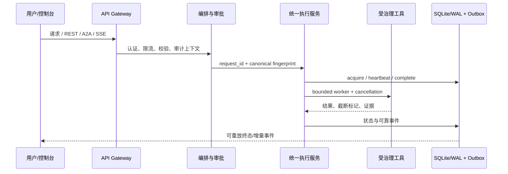

# 架构说明

## 分层结构

1. **接入层**：REST、SSE、A2A 与 MCP 入口统一处理认证、请求体边界、速率限制和审计上下文。
2. **编排层**：将用户意图转为计划、工具调用和审批节点，并把人工接管作为显式状态而不是异常分支。
3. **执行治理层**：`ChatExecutionService` 统一 REST/A2A 生命周期；请求指纹、SQLite WAL、owner token、租约 TTL 和取消注册表共同约束重复副作用。
4. **资源控制层**：同步任务进入 8 worker/32 队列的有界执行器，SSE 使用 64 worker/512 队列的共享池；容量耗尽返回可识别的 503，超时返回 504。
5. **工具与安全层**：命令、文件、Docker、数据库和知识导入都经过安全判定、路径归一化、参数校验、输出上限和敏感信息脱敏。
6. **状态与观测层**：审计链、执行记录、事件 outbox、评测追踪和指标端点提供可回放证据。

## 关键数据流

## 重点工程决策

### 一次执行，多种协议

常见做法是在 REST、A2A 和流式接口分别实现重试、取消和状态写入，协议之间容易出现“一边成功、一边仍显示运行中”。这里把生命周期收敛到统一执行服务，并用 SQLite WAL 作为跨实例的持久权威记录。

### 租约而不是永久锁

进程崩溃时永久运行锁会让相同请求永远无法恢复。执行记录持有 owner token、租约到期时间和心跳；过期租约可以被新执行者接管，仍保留未知结果的冲突语义。

### 可靠事件与普通阶段事件分离

普通阶段事件可以合并或丢弃，终态、审批、错误和取消事件不能与普通事件竞争同一个容量。SSE 缓冲区因此分离 reliable deque，并暴露 dropped/coalesced 指标。

### 输出先限界，再交给上层

命令和 Docker 日志采用分块读取 + 有界尾部环形缓冲；持续 100 MiB 输出不会按总量扩张内存，结果通过 `truncated` 明确告知调用方。
