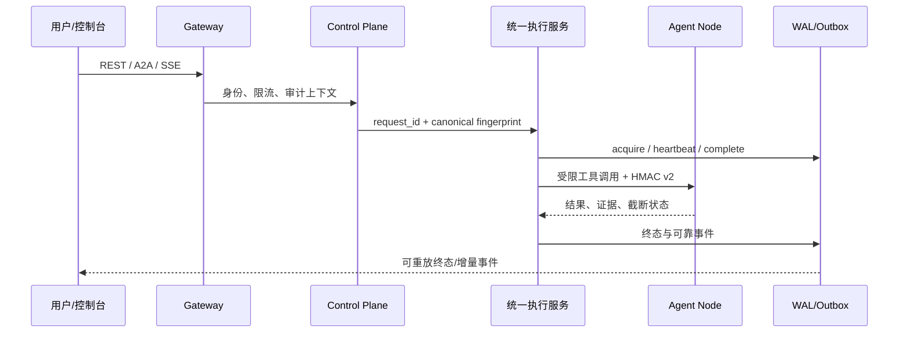

# 架构说明

## TL;DR

Kylin Agent 将“接入、编排、审批、执行、证据、评测”拆成可独立限流的控制面与节点面。核心取舍是：模型只产生受约束的计划，执行器成为副作用唯一入口，SQLite WAL/Outbox、RabbitMQ 和事件序列共同承担可恢复性。

## 问题边界

普通 Agent 往往把 HTTP handler、模型调用、工具执行和结果拼接写在一条链路里；重试时会重复副作用，断线时无法判断终态，节点状态和控制台状态也可能分叉。本项目把边界显式化：Gateway 负责身份与协议，Control Plane 负责意图、计划、审批、审计和评测，Agent Node 负责采集、预检和执行。

## 六服务拓扑

1. **Browser/Vue Panel**：提交请求、显示 SSE、审批和回放。
2. **Nginx**：TLS、静态资源和反向代理边界。
3. **Spring Boot Gateway**：Sa-Token、RBAC、CSRF、HMAC v2 和外部会话治理。
4. **FastAPI Control Plane**：Planning、Approval、Audit、Evaluation 及统一执行生命周期。
5. **Agent Node A/B**：节点身份、能力采集、Preflight、受限工具执行和证据回传。
6. **RabbitMQ + SQLite/etcd**：durable topic、publisher confirm、manual ACK、DLX/DLQ、Outbox、WAL 状态与租约。

可编辑拓扑：[`diagrams/architecture.mmd`](../diagrams/architecture.mmd)；渲染图：[`assets/architecture.svg`](../assets/architecture.svg)。

## 关键数据流

## 非显而易见的工程决策

| 多数实现 | 本项目机制 | 避免的问题 |
| --- | --- | --- |
| REST/A2A/SSE 各自维护生命周期 | `ChatExecutionService` 统一 acquire、heartbeat、complete、cancel | 同一 `client_request_id` 在不同协议下产生两次副作用 |
| 进程内永久锁 | owner token + TTL 租约 + 心跳 + `unknown_outcome` | worker 崩溃后请求永久卡死，或未知结果被误判为可重试 |
| 每个 SSE 请求创建线程 | 共享 64 workers / 512 queue，有界 reliable buffer | 并发连接放大线程数，终态事件被普通日志挤掉 |
| `capture_output=True` 后整体裁剪 | 64 KiB 分块、100 MiB 命令上限、20 MiB SafeExecutor 上限 | 大输出先占满内存，进程被 OOM 杀死 |
| 文件先 Base64 再传输 | `FileResponse`/`StreamingResponse`、Range、Blob、AbortController | 20 MiB 文件额外膨胀约 33%，下载期间无法取消 |

## 验证与边界

- PERF-001～006 已有针对性证据；文件流改造 targeted suite 为 **107 passed / 3 skipped**。
- 资源上限：同步池 **8 workers / 32 queue**，SSE 池 **64 workers / 512 queue**，命令输出 **100 MiB**，SafeExecutor 输出 **20 MiB**，文件流分块 **64 KiB**。
- 这些数字是代码契约与 targeted tests 的结果，不等于生产集群容量基准；生产容量仍需在目标 LoongArch 部署环境复测。

相关文档：[`security-layers.md`](security-layers.md) · [`reliability.md`](reliability.md) · [`trace-replay.md`](trace-replay.md) · [`evaluation.md`](evaluation.md)
